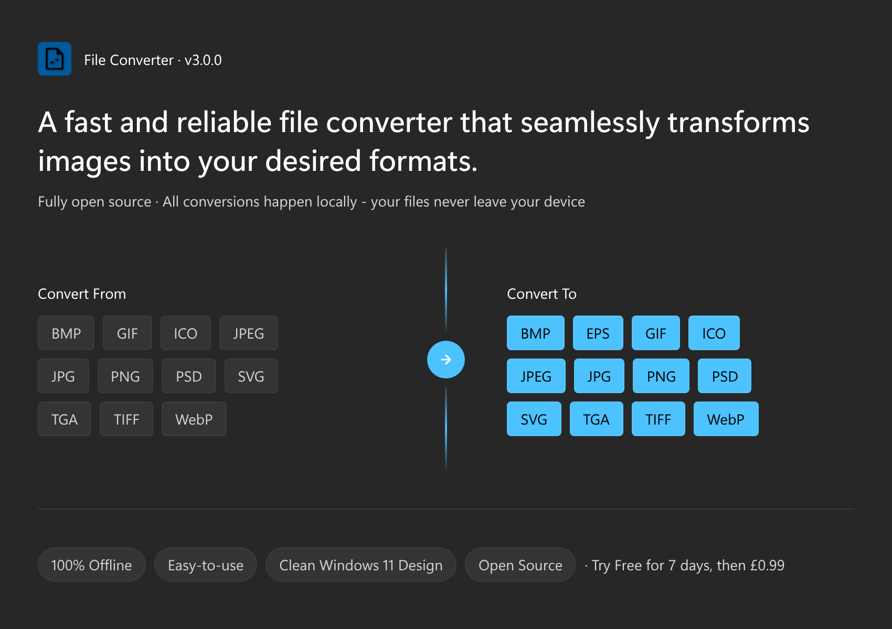
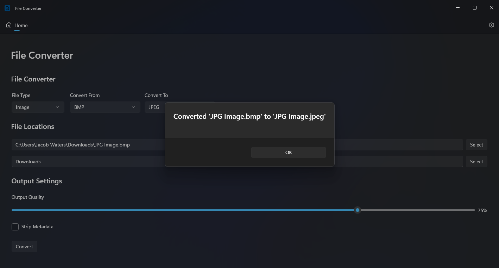
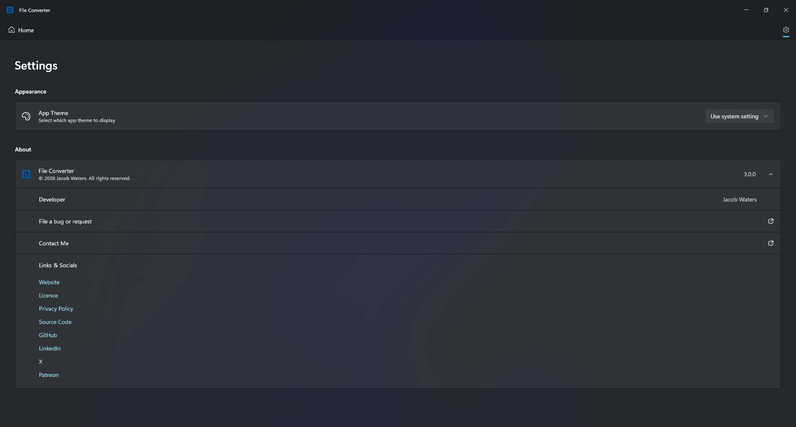

<h1>File Converter</h1>

  

##

  
  
  
  
  

##

A fast and reliable file converter that seamlessly transforms images into your desired formats.

##

**Supported Image Conversions:**
 - **Input:** BMP, GIF, ICO, JPEG, JPG, PNG, PSD, SVG, TGA, TIFF, WebP
 - **Output:** BMP, EPS, GIF, ICO, JPEG, JPG, PNG, PSD, SVG, TGA, TIFF, WebP

##

**Supported Languages:**

Some translations may be inaccurate.

 - Arabic
 - Bengali
 - German
 - English (Australia)
 - English (Canada)
 - English (United Kingdom)
 - English (United States)
 - Spanish
 - French
 - Hindi
 - Italian
 - Japanese
 - Portuguese
 - Russian
 - Turkish
 - Ukrainian
 - Chinese (Simplified)
 - Chinese (Traditional)

##

Support for converting documents, audio, and video files will be added soon.

##

  <h3>Socials:</h3>
  
  
  
  
  

